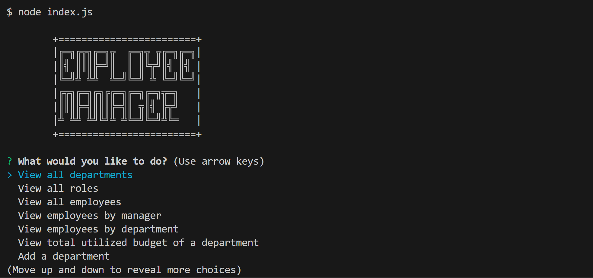
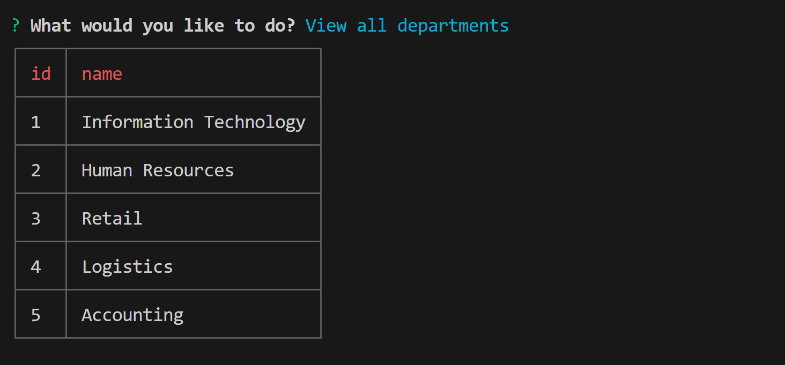
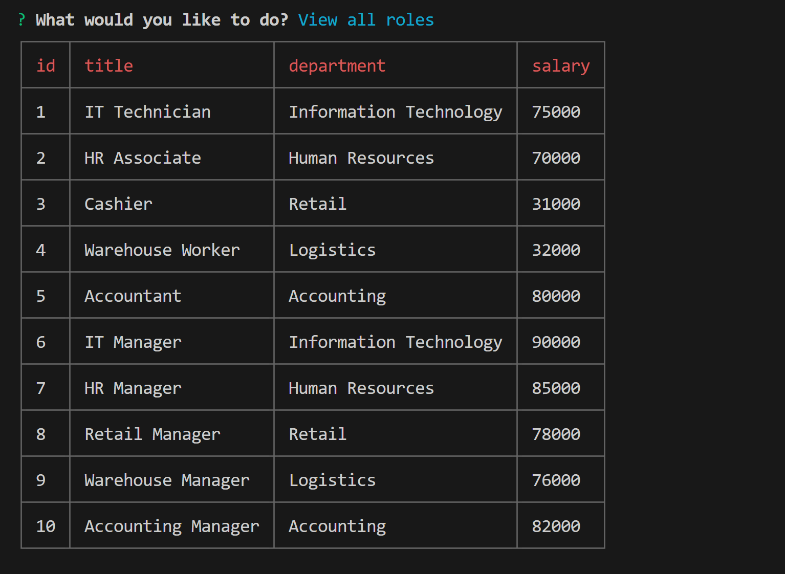
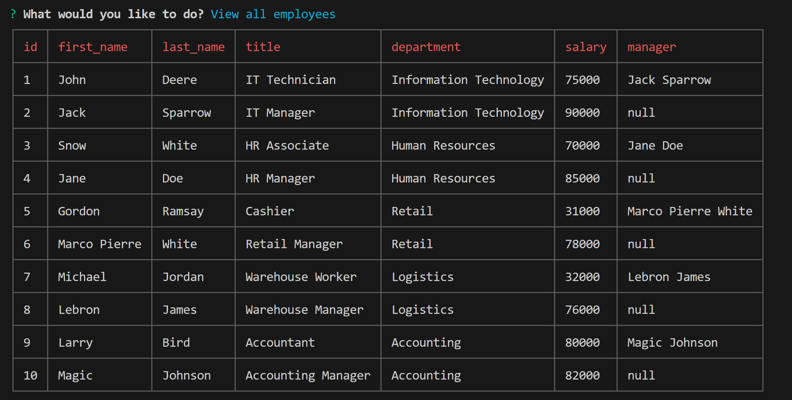

  # 12 Employee Manager SQL

  ## Description

    A cli based sql application that allows users to insert, update and delete records from database tables representing a company db [employee, role, department].

  ## Table of Contents 

  - [Installation](#installation)
  - [Usage](#usage)
  - [Screenshots](#screenshots)
  - [License](#license)

  ## Installation

    Create a .env and populate it with your credentials as DB_USER='' and DB_PASSWORD=''. Login with psql -U #username and run the sql files using the commands \i schema.sql and \i seeds.sql. Return to the root folder then run npm install and node index.js.

  ## Usage

    The interface will continuously present multiple options of viewing, deleting and updating until a user selects the exit option. Choose an option you desire and suboptions will be availble if necessary. Inputs shall then be processed and be reflected on the database.

  ### Video Walkthrough
  
  [Click Here](https://youtu.be/GvMGH85vDrw)
  
  ## Screenshots

    This is the main interface.
  

    This is the department table after selecting view all departments.
  

    This is the role table after selecting view all roles.
  

    This is the employee table after selecting view all employees.
  

  ## License 
  ### Badge 
  

    
      MIT License

      Copyright (c) function getFullYear() { [native code] } 
      
      Permission is hereby granted, free of charge, to any person obtaining a copy
      of this software and associated documentation files (the "Software"), to deal
      in the Software without restriction, including without limitation the rights
      to use, copy, modify, merge, publish, distribute, sublicense, and/or sell
      copies of the Software, and to permit persons to whom the Software is
      furnished to do so, subject to the following conditions:
      
      The above copyright notice and this permission notice shall be included in all
      copies or substantial portions of the Software.
      
      THE SOFTWARE IS PROVIDED "AS IS", WITHOUT WARRANTY OF ANY KIND, EXPRESS OR
      IMPLIED, INCLUDING BUT NOT LIMITED TO THE WARRANTIES OF MERCHANTABILITY,
      FITNESS FOR A PARTICULAR PURPOSE AND NONINFRINGEMENT. IN NO EVENT SHALL THE
      AUTHORS OR COPYRIGHT HOLDERS BE LIABLE FOR ANY CLAIM, DAMAGES OR OTHER
      LIABILITY, WHETHER IN AN ACTION OF CONTRACT, TORT OR OTHERWISE, ARISING FROM,
      OUT OF OR IN CONNECTION WITH THE SOFTWARE OR THE USE OR OTHER DEALINGS IN THE
      SOFTWARE.
      

  https://choosealicense.com/licenses/mit/
  

  